# Swip · Cardy — Project Documentation

**Cardy** is an AI-first card-support assistant for **Swip**, a fictional card fintech built on the synthetic *LATAM Bank* dataset of the **Factored AI & Data Hackathon 2026**. Cardy speaks Spanish (Mexico, Colombia, Argentina) and Brazilian Portuguese. It answers card questions from verified bank data, carries out card actions only after the customer confirms them and the result is read back, and hands the case to a person, with full context, whenever the decision isn't the bot's to make.

> **Cardy knows when not to act.**

This document describes the whole system on its own terms: the problem, what was built, the architecture, the four technical dimensions (AI Engineering, Data Engineering, Machine Learning, Data Analytics), evaluation, security, the design rationale, and how to run it. The detailed design documents under [`docs/solution-docs/`](docs/solution-docs/README.md) remain the source of truth for every contract and decision; this document is the map.

---

## Table of contents

1. [Introduction](#1-introduction)
2. [Key features](#2-key-features)
3. [System architecture](#3-system-architecture)
4. [Key dimensions](#4-key-dimensions)
   - 4.1 [AI Engineering](#41-ai-engineering)
   - 4.2 [Data Engineering](#42-data-engineering)
   - 4.3 [Machine Learning](#43-machine-learning)
   - 4.4 [Data Analytics](#44-data-analytics)
5. [Evaluation and testing](#5-evaluation-and-testing)
6. [Security, privacy and responsible AI](#6-security-privacy-and-responsible-ai)
7. [Design rationale and trade-offs](#7-design-rationale-and-trade-offs)
8. [Running and trying it](#8-running-and-trying-it)
9. [Limitations and path to production](#9-limitations-and-path-to-production)
10. [Appendix](#10-appendix)

---

## 1. Introduction

### 1.1 The problem

Card support is high-volume and repetitive: *"why was my card declined?"*, *"I don't recognize this charge"*, *"block my card"*, *"how much do I owe?"*. Most of these can be resolved from data the bank already has. Some must not be resolved by a bot at all: fraud triage, a block placed by the bank, a regulator complaint, a customer who failed identity verification. A useful assistant has to do three things well:

| Required behavior | What Cardy does | Example |
|---|---|---|
| **Resolve** what it can verify | Reads the customer's own data, explains it, and performs card actions after explicit confirmation and a verified read-back | *"Bloquea mi tarjeta de crédito"* → confirmation card → *"Listo: tu tarjeta •••• 4417 quedó bloqueada a las 10:32."* |
| **Clarify** what is ambiguous | Asks one precise question instead of guessing | *"bloquear"* (temporary lock or permanent block?), *"la tarjeta"* when the customer has two |
| **Escalate** what isn't the bot's to decide | Hands the case to the right human queue with a structured packet | Several unrecognized charges → block + claim + handoff to **Fraudes** |

### 1.2 Swip and Cardy

**Swip** is a fintech that issues and manages credit and debit cards. **Cardy** is its assistant: warm but precise, transparent about what it did and didn't do, and never says "done" without tool confirmation. The voice and visual identity live in [`docs/brand.md`](docs/brand.md).

### 1.3 Scope

| In scope | Out of scope (Cardy abstains with a structured reply) |
|---|---|
| Card status and details, balance due and minimum payment, available balance (debit) | Loans, accounts, investments, insurance, transfers |
| Decline explanations (codes 51, 14, 05, 54) | Pix, boleto, CPF (Brazilian rails: *out of market*) |
| Transaction search, pending and reversed charges | New card applications |
| Temporary lock / unlock (with step-up OTP) / permanent block | Financial advice, selling products |
| Unrecognized charges → claim (dispute) | Deciding disputes or fraud cases |
| Card replacement | |
| Human handoff with live takeover | |

**Markets and languages:** Mexico, Colombia, Argentina (Spanish) and Brazilian Portuguese customers. Mexican cards are denominated in USD (a dataset fact), so amounts are shown in USD with an MXN approximation.

### 1.4 Design principle: *LLM at the edges, rules in the middle*

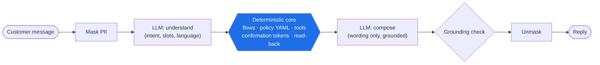

The LLM reads language and writes language. Everything that decides — which tool runs, whether an action is allowed, how money is formatted, when to escalate — is code and versioned policy. The model never supplies a `customer_id`, never holds a write tool while reading tool output, and never formats a number.

### 1.5 Synthetic data notice

All bank data is the organizers' synthetic LATAM Bank dataset. All policy (decline codes, minimum-payment formula, escalation rules, dispute thresholds) is **team-generated synthetic policy**, labeled `provenance: team-generated-synthetic` in every file. All evaluation utterances are team-generated and labeled as such. No real customer data is used anywhere.

### 1.6 How to read this document

- Sections 1–3 give the product and architecture overview.
- Section 4 is organized by the four judging dimensions.
- Sections 5–7 cover evaluation, safety and rationale.
- Section 8 tells you how to run or try it; section 10 maps judging criteria to sections.
- Status labels: **Built** (implemented and tested), **Partial** (implemented, some part pending), **Stretch** (designed, not built).

---

## 2. Key features

### 2.1 Feature table

| Area | Feature | Status |
|---|---|---|
| **Conversation** | LangGraph turn graph with deterministic flows per intent | Built |
| | LLM NLU (multi-intent, slots, language detection, injection flag) | Built |
| | Grounded composer with regenerate-then-template fallback | Built |
| | Tool-calling agent node for conversation and reads, proposes plans only (`AGENT_ENABLED`) | Built |
| | Conversation memory (last messages + summary), card in focus, "la otra" resolution | Built |
| | Proactive closing suggestion, no repeated introduction | Built |
| **Card actions** | Lock, unlock (step-up OTP), permanent block, replacement (step-up when address changes) | Built |
| | Multi-step plans with one confirmation (block + replace, block several cards) | Built |
| | Server-issued single-use confirmation tokens, verified read-back | Built |
| **Disputes** | Unrecognized charge flow, compromise rule, claim creation (`CLM-…`) | Built |
| | Priority claims (repeat complainer, high amount, open Critical complaint) → Reclamos | Built |
| **Handoff** | Four queues, structured handoff packet, LLM case summary | Built |
| | Live takeover: claim, chat as agent, return to bot | Built |
| | One-click staff actions through the policy engine | Stretch |
| **Safety** | Session-bound identity, PII vault, data fences, injection handling | Built |
| | Retries, typed errors, fault injection, degraded no-LLM mode | Built |
| | Cost guard: turn caps, kill switch, budget alarm | Built |
| **ML** | Trained intent classifier (TF-IDF + LR) used as LLM fallback | Built |
| | Sentiment scoring for analytics (LLM step on masked text) | Built |
| **Data** | S3 → Parquet → Pandera → dbt-duckdb → Postgres → golden DB pipeline | Built |
| | Date shift, fixtures for late partitions / schema change / duplicates, lineage | Built |
| **Analytics** | Interaction fact tables + analytics worker | Built |
| | Admin analytics dashboard | Built |
| | Staff traceability console ("why did the bot say this?") | Built |
| | Eval scorecard in the staff console | Stretch |
| **Frontend** | Landing, customer home ("Swip Panel"), chat, staff inbox, timeline, analytics; ES/PT toggle | Built |
| **Eval** | Harness, simulator, judges, dev suite, metrics with CIs | Built |
| | Frozen held-out suite run and reported | Partial |
| **Deployment** | Single EC2 + Docker Compose on AWS, TLS, SSM secrets, budget | Built |
| | Judges' quick access (`DEMO_QUICK_LOGIN`) | Built |

### 2.2 Demo walkthrough of the three behaviors

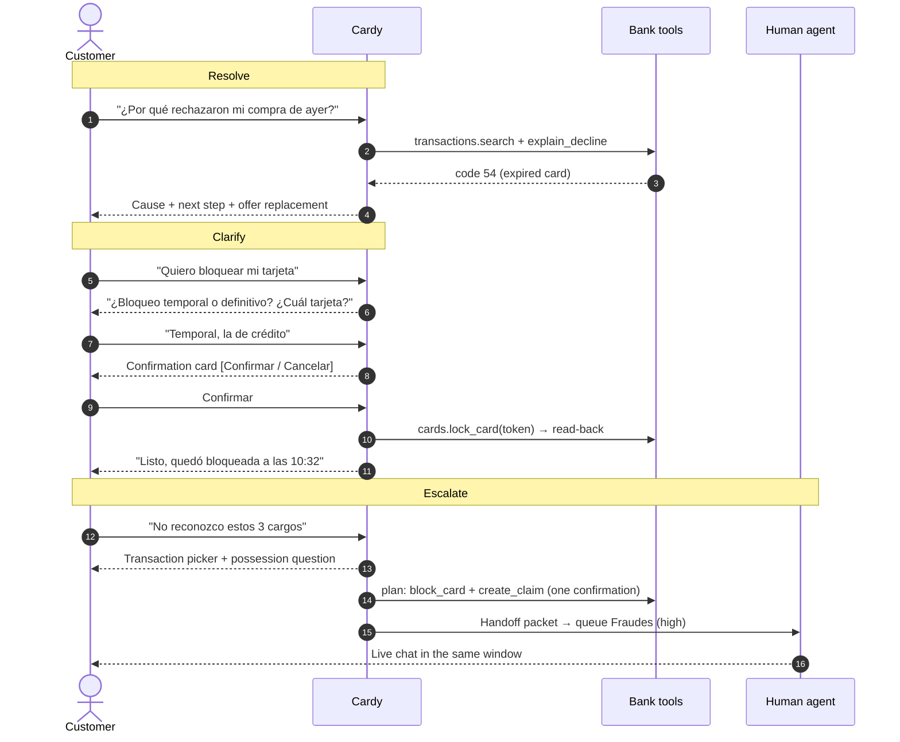

---

## 3. System architecture

### 3.1 Overview

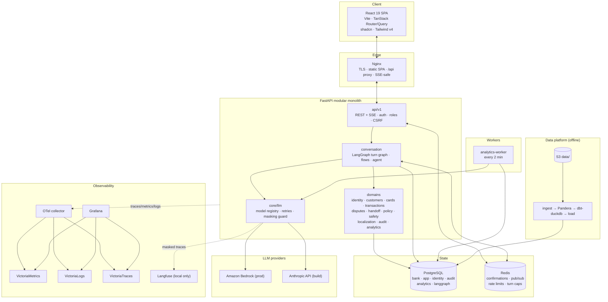

### 3.2 Technology stack

| Layer | Technology | Why |
|---|---|---|
| API | FastAPI, Pydantic v2, SQLModel + asyncpg, Alembic | Typed contracts, async I/O, OpenAPI → generated TS client |
| Conversation | LangGraph with a Postgres checkpointer | Explicit, inspectable state machine; durable pauses (confirmation, OTP, pickers) |
| LLM | **Amazon Bedrock** in prod; Anthropic API during the build (ADR-028) | **Customer data never leaves AWS:** the model runs inside AWS, the provider never sees prompts, and access is by IAM role with no API keys (§6.4) |
| Cache / bus | Redis | Confirmation tokens with TTL, pub/sub for live takeover, rate limits, turn caps, idempotency |
| Frontend | React 19, Vite, TanStack Router + Query, shadcn/ui, Tailwind v4, Recharts | File-based routes, typed client, accessible components |
| Data | DuckDB + dbt-duckdb, Pandera, Parquet | Fast local transforms over 5.35 GB of CSVs, tested contracts, lineage |
| ML | scikit-learn (TF-IDF + logistic regression) | Small, fast, CPU-only, explainable, committed bundle |
| Infra | Docker Compose (base / dev / devtools / observability / prod layers), Nginx, certbot | Same artifact in dev and prod |
| Observability | OpenTelemetry → VictoriaMetrics / Logs / Traces + Grafana; Langfuse self-hosted | Full traces, plus LLM-specific tracing kept local |
| Cloud | AWS: EC2, S3, SSM, IAM, Bedrock, Budgets, CloudFormation | Single-box deployment, least-privilege role, no long-lived keys |
| Quality | ruff, mypy, import-linter, pytest, Biome, Playwright, gitleaks, pre-commit | Enforced boundaries and safety rules in CI |

### 3.3 Domain map and boundaries

The backend is a **modular monolith**. Layers are enforced by **import-linter** contracts in CI: `api → domains → core`, never the reverse.

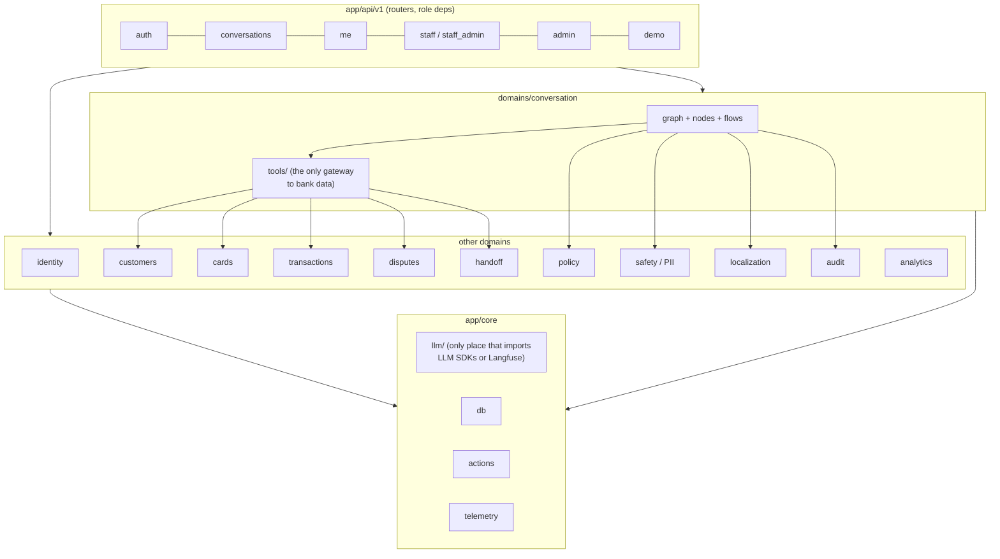

Rules enforced:
- `conversation` reaches bank data **only** through `conversation/tools`.
- Only `core/llm` imports LLM SDKs or Langfuse.
- `analytics` imports no `conversation` module (it reads audit rows).

### 3.4 Lifecycle of one turn

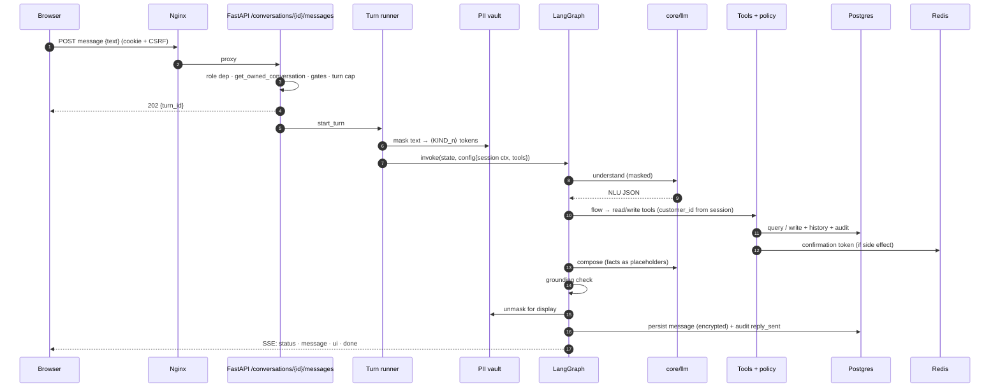

The HTTP request returns `202` immediately; output streams over **Server-Sent Events** (`status`, `message`, `ui`, `mode`, `error`, `done`, and `debug` outside prod).

---

## 4. Key dimensions

## 4.1 AI Engineering

### 4.1.1 The conversation engine (LangGraph turn graph)

Each customer message runs one pass of a LangGraph graph. State is checkpointed in Postgres, so pauses (waiting for a confirmation, an OTP, a card pick, a transaction selection, an address) survive restarts and resume exactly where they left off.

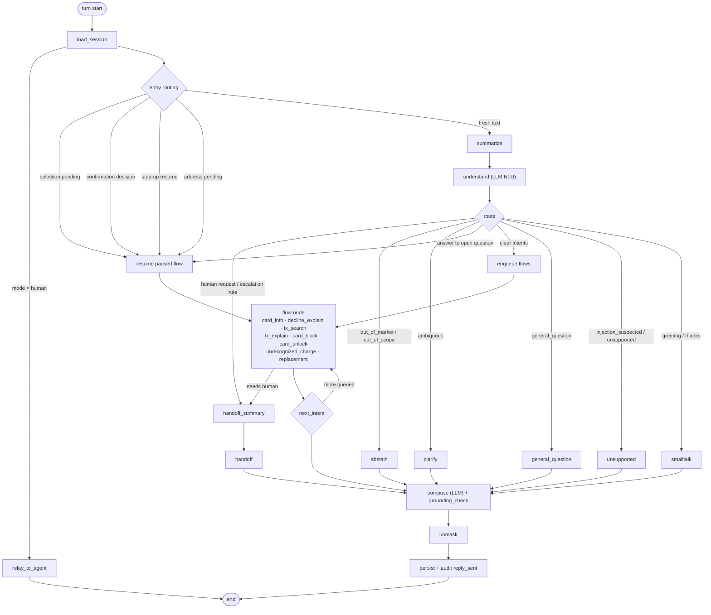

**Nodes:** `load_session`, `summarize`, `understand`, `route`, `abstain`, `smalltalk`, `unsupported`, `fallback`, `next_intent`, `compose`, `handoff_summary`, `handoff`, `relay`, `step_up_exit`.

**Flows** (`backend/app/domains/conversation/flows/`): `card_select`, `card_info`, `decline_explain`, `tx_search`, `tx_explain`, `card_block`, `card_unlock`, `unrecognized_charge`, `replacement`, plus shared `actions`.

**Intent registry** (`conversation/intents.yaml`, the single source):

| Group | Intents |
|---|---|
| Cards & transactions | `card_status`, `balance_due`, `decline_explain`, `transaction_search`, `pending_reversal_explain`, `card_block`, `card_unlock`, `unrecognized_charge`, `replacement_request` |
| Conversation management | `human_request`, `general_question`, `greeting`, `thanks_close`, `affirm`, `deny` |

**NLU output contract** (validated JSON):

```json
{
  "language": "es | pt | mixed | other",
  "intents": ["card_block", "decline_explain"],
  "status": "clear | ambiguous | out_of_scope | out_of_market | injection_suspected",
  "slots": {
    "card_hint": "credit | debit | focus | other | last4:6475 | null",
    "block_kind": "temporary_lock | permanent_block | null",
    "date_expression": "el martes pasado",
    "merchant_text": "super ahorro",
    "amount": 350.0, "amount_approx": true,
    "currency": "COP | ARS | USD | MXN | null",
    "pending_answer": "affirm | deny | <slot value> | null",
    "topic": "loans | accounts | investments | insurance | transfers | pix_boleto | new_card | other | null"
  },
  "clarification": "lock_vs_block | which_card | which_transaction | null"
}
```

Multi-intent messages are queued and served in order (`next_intent`). Dates such as *"el martes pasado"* are resolved by code in the customer's bank time zone, never by the model.

### 4.1.2 Example flow: card block

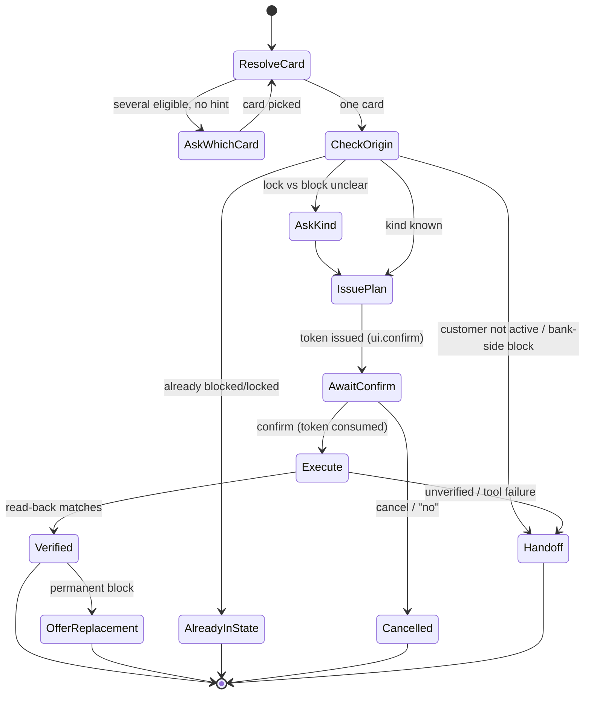

### 4.1.3 The agent node (ADR-035, `AGENT_ENABLED`)

A tool-calling agent handles open conversation and read questions more naturally than fixed flows, without gaining any power to act.

| Property | Value |
|---|---|
| Model | `claude-sonnet-5-5` (API); Sonnet 4.6 via a `us.` inference profile on Bedrock |
| Loop limit | 6 tool rounds; hitting the cap hands off with reason `agent_round_cap` |
| Read tools | card status, balance due, debit balance, transaction search, decline explanation — thin wrappers over audited bank tools, returning **fenced facts** formatted in code |
| Other tools | `scope_facts(topic)`, `propose_plan(steps)`, `pass_to_flow()` |
| Write capability | **None.** `propose_plan` validates and issues a token; it executes nothing |
| Execution | Only from the button (*Acepto / No acepto*); typed "sí" does not execute an agent plan |
| Pauses | `agent/otp` (step-up), `agent/address` (new delivery address), handled by code nodes `agent_step_up` and `agent_address` |

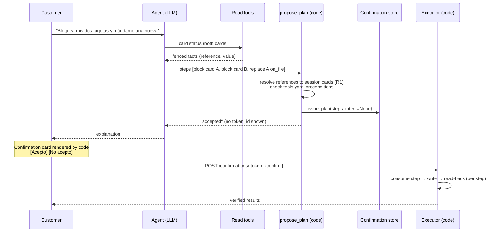

Reason codes returned to the agent: `unknown_reference`, `already_in_state`, `already_locked`, `tool_not_allowed`, `not_locked`, `permanent_block`, `not_eligible`, `address_mismatch`. After a verified permanent block, **code** (not the agent) makes the replacement offer (`bot_offered`).

### 4.1.4 LLM steps and model registry

All LLM access goes through `backend/app/core/llm/`. Each step pins a model, prompt version and temperature (R7); every attempt is written to `audit.llm_calls` with masked input, tokens, latency and cost.

| Step | Purpose | Model (build / API) | Model (prod / Bedrock) |
|---|---|---|---|
| `nlu` | Intent, slots, language, status | Sonnet 5.5 | Sonnet 4.6 (`us.` profile) |
| `agent` | Tool-calling conversation | Sonnet 5.5 | Sonnet 4.6 |
| `compose` | Reply wording with placeholders | Haiku 4.5 | Haiku 4.5 |
| `summary` | Rolling conversation summary | Haiku 4.5 | Haiku 4.5 |
| `handoff_summary` | `request` + `case_summary` for staff | Haiku 4.5 | Haiku 4.5 |
| `sentiment` | Analytics sentiment labels | Haiku 4.5 | Haiku 4.5 |
| `paraphrase`, `simulate`, `intent_gen` | **Eval / training data only** | `gpt-6-luna` (different family, ADR-030) | — |

Using a different model family for eval data generation and simulation avoids grading the system with its own biases.

### 4.1.5 Tools and the policy engine

**Tool registry.** Every bank tool is a typed async function with metadata. The registry, not the model, binds `customer_id` from a `ToolContext` built from the session:

```python
class ToolContext(BaseModel):          # built by the registry, never by the model
    customer_id: str
    conversation_id: UUID
    actor: Literal["customer", "agent", "system"]
    trace_id: str
    policy_version: str

class ToolSpec(BaseModel):
    name: str; side_effect: bool; requires_confirmation: bool; requires_step_up: bool
    allowed_intents: list[str]; timeout_s: float; retries: int = 2
```

| Tool | Side effect | Confirm | Step-up |
|---|---|---|---|
| `customers.get_profile` | — | — | — |
| `cards.list_cards`, `cards.get_card_details`, `cards.get_block_origin` | — | — | — |
| `cards.lock_card` | ✓ | ✓ | — |
| `cards.unlock_card` | ✓ | ✓ | always |
| `cards.block_card` | ✓ | ✓ | — |
| `cards.order_replacement` | ✓ | ✓ | when address changed |
| `transactions.search`, `.get`, `.get_by_ids`, `.explain_decline` | — | — | — |
| `disputes.create_claim` | ✓ | ✓ | — |
| `disputes.get_priority_signals` | — | — | — |
| `handoff.create` | internal | — | — |
| `reference.get_fx_rate` | — | — | — |

Typed errors: `NotFound`, `AccessDenied` (another customer's resource; audited), `ToolUnavailable`, `PolicyDenied(reason)`, `ConfirmationRequired(unknown_or_expired | step_mismatch | wrong_owner)`, `StepUpRequired`, `Conflict`.

**Write path.** The graph only ever holds `ConfirmedWriteTools`, the single enforcement point for confirmations (R2). Each write runs:

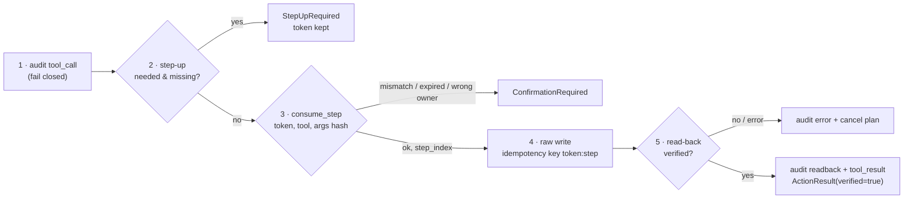

**Confirmation tokens (plans, ADR-027).** Every confirmation is a plan of one or more ordered steps, stored in Redis as `conf:<id>` with a 5-minute TTL. A Lua script advances the cursor atomically.

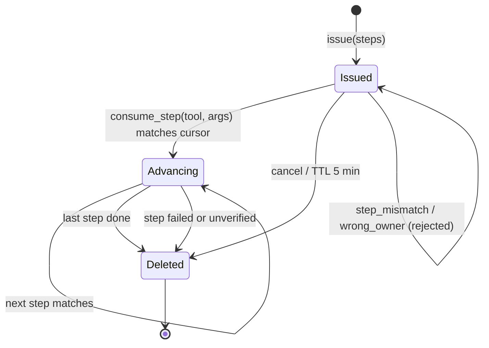

A token can't be reused, reordered or extended, and belongs to one customer and conversation.

**Read-back (R3).** `ActionResult.verified` is a required field with no default. A flow may report success only when it is `true`. Example read-backs: `lock_card → {locked: true, at}`, `block_card → {status: "Blocked", at}`, `create_claim → {status: "Open", count, at}`.

**Step-up.** A fixed 4-digit demo OTP (environment variable) verified in constant time, valid for `step_up_window_minutes: 5`. Three failures at an open OTP pause hand off to **Fraudes** as `step_up_failed`.

**Policies (`policies/*.yaml`).** Every file carries `provenance: team-generated-synthetic` and a `version`; startup fails otherwise. A combined SHA-256 hash is stamped on every audit event.

| File | Governs |
|---|---|
| `tools.yaml` (v4) | Confirmation and step-up rules, intent allowlists, agent preconditions, `step_up_max_failures` |
| `escalation.yaml` (v9) | Handoff rules → queue + priority, legal keywords, degraded handoff intents, packet history window |
| `disputes.yaml` | Compromise rule, questions, priority thresholds per currency |
| `decline_codes.yaml` | Codes 51, 14, 05, 54 → cause, next step, self-service |
| `min_payment.yaml` | Synthetic minimum-payment formula and due day |
| `transaction_states.yaml` | Pending / reversed explanations and hold days |
| `card_select.yaml` | Picker eligibility, replacement eligibility, next-step offers, closing suggestions |
| `scope.yaml` | Out-of-scope / out-of-market topics → reason, closest intents, human queue |
| `playbooks.yaml` | Agent guidance per request type (wording only, never grants a tool) |

### 4.1.6 Grounded composition

The composer never sees raw values. It receives **placeholder keys** (`{card}`, `{amount}`, `{date}`) for facts formatted in code, and writes the sentence around them.

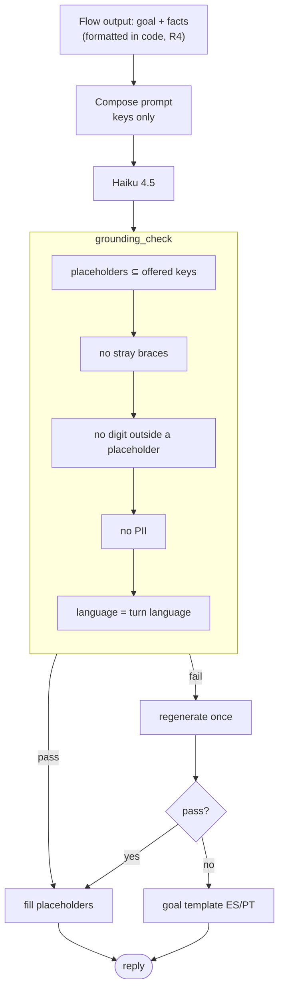

`reply_sent` records the outcome (`ok | regenerated | template`) and the list of code-written `fact_values`, which the eval grounding check reads.

### 4.1.7 Memory and personality

- **Memory:** the last 6 messages plus a rolling LLM summary (`summarize` node), and the **card in focus**, so *"la otra"* resolves to the other card without asking again.
- **Personality** (from requirements *personalidad* and *naturalidad*): greets a returning customer without re-introducing itself; closes each flow with one suggestion for a next useful service (`closing_suggestion` in `card_select.yaml`); tone lowers warmth and raises precision as risk rises; never jokes in fraud, errors or disputes.

### 4.1.8 Handoff and live takeover

| Queue | Typical reasons |
|---|---|
| `atencion` | Human request, clarification exhausted, customer not active, unverified action, unauthorized access, agent round cap |
| `cobranza` | Bank-side block for past-due |
| `fraudes` | Suspected fraud, bank-side fraud block, step-up failed |
| `reclamos` | Legal / regulator mention (Condusef, SIC, BCRA, Procon…), priority claim |

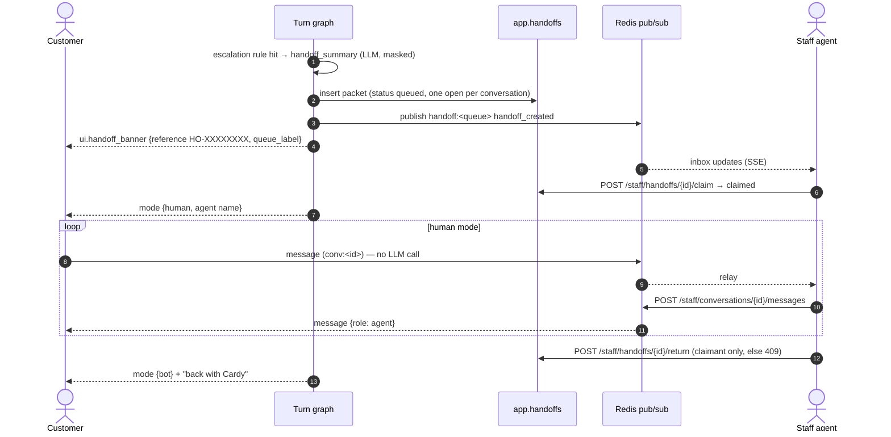

**Handoff packet** (built in code; only `request` and `case_summary` are LLM-written, from masked text, length-capped):

```json
{
  "queue": "fraudes", "priority": "high", "reason": "suspected_fraud", "language": "es",
  "request": "Cliente no reconoce 3 compras con su tarjeta de crédito •••• 6475 y pide bloquearla.",
  "case_summary": {"asked": "…", "did": "…", "unfinished": "…"},
  "verified_facts": [{"fact": "card_status", "value": "Blocked", "source": "audit:<id>"}],
  "actions_taken": [{"tool": "cards.block_card", "verified": true},
                    {"tool": "disputes.create_claim", "verified": true, "case_ids": ["CLM-…"]}],
  "evidence": [{"type": "transaction", "ref": "TX-1", "fraud_score": 72}],
  "open_questions": ["¿El cliente tiene la tarjeta física en su poder?"],
  "routing": {...}, "risk": {...}, "history": {...}, "friction": {...},
  "policy_version": "sha256:…"
}
```

### 4.1.9 Disputes (unrecognized charges)

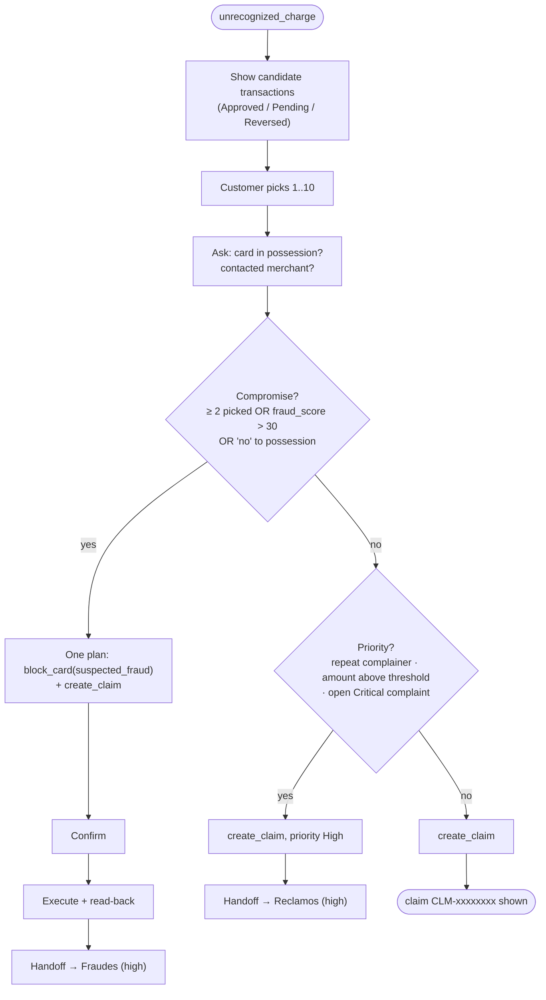

Claims are written to `bank.complaints` with `origin='app'`, one row per transaction, idempotent per `<token>:<step>:<tx_id>`.

### 4.1.10 Reliability, degraded mode and cost guard

| Mechanism | Detail |
|---|---|
| Retries | 2 retries with exponential backoff and jitter (R11) |
| Timeouts | LLM 20 s, tools 3 s |
| Idempotency | Unique idempotency keys on every write table; replays re-read instead of writing twice |
| Fault injection | `FAULTS=bedrock_timeout,cards_write_error,readback_mismatch` (refused in prod) |
| Safe fallback | After retries: degraded path, or a safe fallback reply plus handoff (`tool_failure`, `llm_unavailable`) |

**Degraded mode (ADR-032).** If the LLM fails after retries, or the `LLM_DISABLED` kill switch is on, the turn runs with no LLM at all:

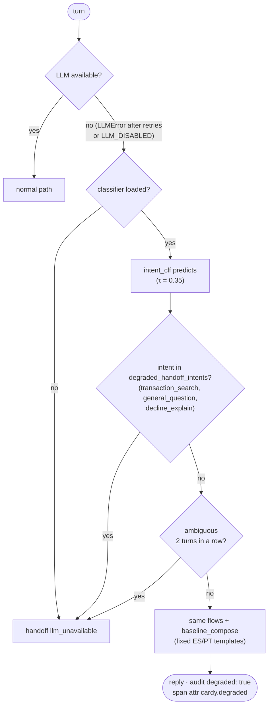

**Cost guard (ADR-023).**

| Control | Value |
|---|---|
| Turns per conversation | 40 bot turns → `429 turn_cap_reached` |
| Turns per account per UTC day | 150 |
| Kill switch | `LLM_DISABLED=true` → degraded mode |
| Login rate limit | 5 failures / 15 min per HMAC login key |
| Budget | AWS Budgets monthly alarm ($90, below the USD 100 credits) |

### 4.1.11 Backend API

All routes are under `/api/v1`. Roles are enforced with router-level dependencies (`require_role`), not per route (ADR-025).

| Group | Main routes | Role |
|---|---|---|
| Health | `GET /health` | public |
| Auth | `POST /auth/login`, `/logout`, `/refresh`, `GET /auth/me`, `POST /auth/otp/verify` | customer |
| Customer data | `GET /me/cards`, `/me/cards/{id}`, `/me/transactions` | customer |
| Conversation | `POST /conversations`, `POST /conversations/{id}/messages`, `POST …/confirmations/{token}`, `GET …/stream` (SSE) | customer (owner) |
| Staff | `POST /auth/staff/login`, `GET /staff/handoffs`, `…/stream`, `…/{id}`, `…/claim`, `…/return`, staff chat + stream | agent, admin |
| Traceability | `GET /staff/conversations`, `GET /staff/conversations/{id}/timeline`, `GET /staff/system` | agent, admin |
| Admin | `GET /staff/analytics/summary`, `GET /staff/personas…`, `POST /admin/demo/reset` (gated by `DEMO_RESET_ENABLED`) | admin |
| Judges | `GET /demo/catalog`, `POST /demo/sessions/customer`, `/staff` (only when `DEMO_QUICK_LOGIN`) | public |
| Eval | `POST /test-idp/sessions` (only when `APP_ENV=eval`) | eval |

**SSE events:** `status {step}` · `message {role, text, sources}` · `ui {card_picker | confirm | transaction_list | otp_required | handoff_banner | quick_replies | conversation_closed}` · `mode {bot | human}` · `error {code}` · `done {turn_id}` · `debug` (non-prod only).

### 4.1.12 Frontend

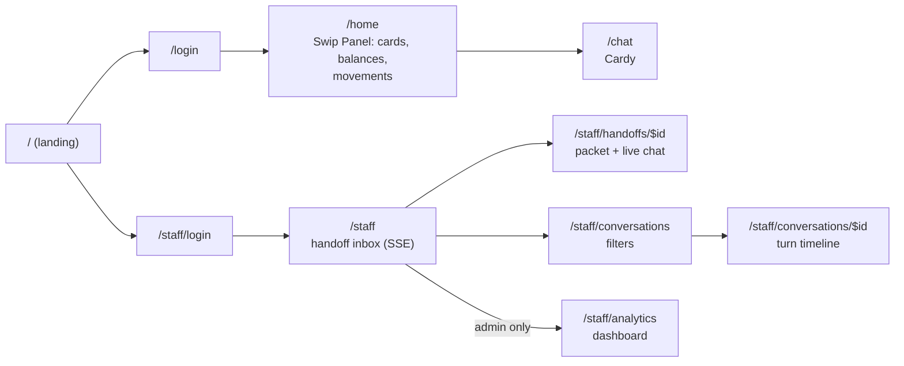

- React 19 + Vite + TanStack Router (file-based) + TanStack Query; API types are generated from OpenAPI (`make client`).
- shadcn/ui + Tailwind v4 with the Swip brand tokens; Recharts for analytics.
- ES/PT toggle on every page (ADR-022); a key missing from `pt.json` is a type error.
- Chat renders code-built UI blocks: card pickers, confirmation cards listing every plan step, transaction lists (multi or single pick), OTP modal (Send / Cancel), handoff banner, quick replies.
- Playwright e2e specs: `block.pt`, `card-info.es`, `unrecognized.es`, `session-expiry.es`, `home.es`, `staff.es`, `traceability.es`, `analytics.es`.

### 4.1.13 Deployment on AWS (ADR-017)

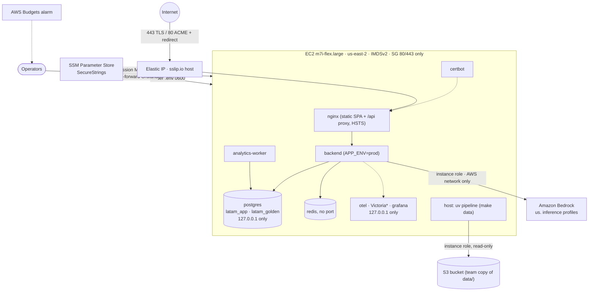

| Item | Decision |
|---|---|
| Shape | One EC2 instance running the prod Compose layer (base → observability → prod) |
| Region | us-east-2 for everything (the AWS project allows a single Region) |
| Infra as code | `infra/aws/ec2-stack.yaml` (CloudFormation): security group, IAM role + profile, instance, EIP, Budget |
| Scripts | `render-env.sh` (SSM → `.env`), `deploy.sh`, `smoke.sh`; `make infra-up`, `deploy`, `deploy-remote`, `smoke-prod` |
| Access | No SSH; SSM Session Manager only. IMDSv2 required, least-privilege role (S3 read, Bedrock invoke, SSM) |
| LLM | Amazon Bedrock through the instance role: customer data stays on the AWS network and never reaches the model provider (§6.4) |
| Secrets | SSM SecureStrings rendered to a `0600` `.env`; no AWS keys on the box |
| TLS | Let's Encrypt via certbot (HTTP-01); Route 53 domain as fallback |
| Data | Built on the box with `make data` from the team's own S3 copy, so the date shift lands on the deploy date |
| Cost | ≈ $80/month infra + Bedrock usage, bounded by the cost guard |
| Judges | `DEMO_QUICK_LOGIN=true` during judging only; `DEMO_RESET_ENABLED=false` in prod |

Why one box rather than ECS/RDS: it deploys the exact artifact the judges can reproduce locally, keeps demo-reset (`CREATE DATABASE … TEMPLATE`) and the observability stack unchanged, fits the measured footprint (≈ 1.1 GiB RAM for prod services, ≈ 15.5 GB Postgres), and fits the plan. The ECS/RDS option is the documented path to production (§9).

### 4.1.14 Observability

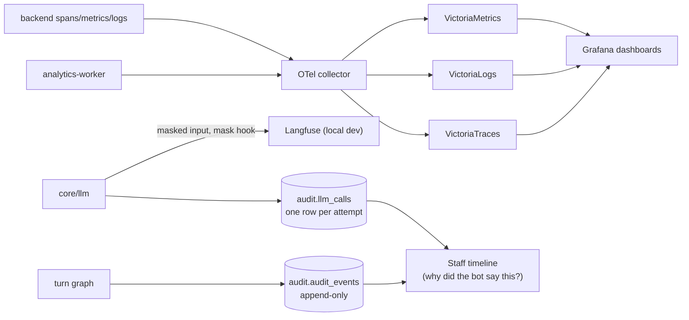

- Every turn is one trace; the span carries `cardy.degraded`.
- `audit.audit_events` (append-only) records `nlu_result`, `rule_hit`, `tool_call`, `tool_result`, `confirmation_issued/used`, `readback`, `access_denied`, `handoff`, `reply_sent`, `error`, each with sources, policy version, model and trace ids.
- `audit.llm_calls` is the public ledger of every LLM attempt (model, prompt version, temperature, tokens, latency, cost). Langfuse is not on the public deployment (ADR-006); it stays local.
- `GET /staff/system` exposes git SHA, model per step, prompt versions and the policy hash.

---

## 4.2 Data Engineering

### 4.2.1 Sources and provenance

| Source | Content | Provenance label |
|---|---|---|
| Organizers' S3 `data/` | 13 tables, 7,671 CSV files, 5.35 GB | Synthetic (organizers) |
| `policies/*.yaml` | Bank rules | `team-generated-synthetic` |
| `eval/` scenarios, NLU items, personas | Test utterances and expectations | Team-generated |
| `analytics.*` with `source='mock'` | 30-day backfill for the dashboard | `team-generated-synthetic` |

The deployment reads from the **team's own S3 copy** in us-east-2 (copied once, verified by file count and size), never from the organizers' bucket.

### 4.2.2 The pipeline (`make data`)

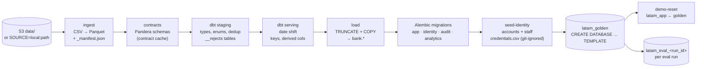

| Stage | Tooling | Notes |
|---|---|---|
| Ingest | Python (`pipeline/ingest`), boto3 | Incremental by manifest; local source supported |
| Contracts | Pandera | Fails fast on schema drift; rejects are kept, not dropped silently |
| Transform | dbt-duckdb (69 models and tests, ≈ 8 min) | DuckDB capped at 3 GB memory, spills to disk |
| Load | `pipeline/load/postgres.py` | `TRUNCATE` + `COPY` |
| Identity | `seed-identity` | Passwords derived from `CREDENTIALS_SEED`, so rebuilds produce the same credentials |
| Golden | Postgres template DB | Instant reset and per-run eval clones |

### 4.2.3 Simulated "now": the date shift (ADR-010)

The dataset ends on **2026-06-17**. To make "last Tuesday" meaningful, all dates are shifted forward by whole weeks at load time, preserving weekdays:

```
date_offset_days = 7 × floor((load_date − max_data_date) / 7)
```

Each country displays dates in its bank time zone (`America/Mexico_City`, `America/Bogota`, `America/Argentina/Buenos_Aires`); `process_date` uses UTC−6.

### 4.2.4 Data quality, freshness fixtures and lineage

| Fixture | Simulates | Handling |
|---|---|---|
| `late_partition` | A partition arriving after its date | Manifest-driven re-ingest |
| `schema_change` | `merchant_name` → `merchant`, new `installments` column | Contract mapping, staging normalizes |
| `duplicate_batch` | A batch delivered twice | Dedup in staging, duplicates in `__rejects` |

Lineage is published with `dbt docs` and summarized in `pipeline/lineage.md`.

### 4.2.5 Database design

Six Postgres schemas, each with one responsibility:

| Schema | Tables | Notes |
|---|---|---|
| `bank` | 13 provided tables: `customers` (150k), `products`, `transactions`, `complaints`, `call_center_interactions`, `call_transcripts`, `satisfaction_surveys`, `digital_events` (10M), `campaign_sends`, `branches`, `service_agents`, `marketing_campaigns`, `daily_exchange_rates` | Provided data; app-appended rows carry `origin='app'` (R12) |
| `app` | `card_status_history`, `card_controls`, `card_replacements`, `conversations`, `messages` (encrypted content), `handoffs`, `pii_vault` (Fernet), `system_metadata` | Writes go here + history rows |
| `identity` | `accounts`, `revoked_tokens` | HMAC login keys, PBKDF2 hashes |
| `audit` | `audit_events` (append-only), `llm_calls` | Masked payloads only |
| `analytics` | `interactions`, `interaction_intents`, `worker_state` | Fact tables for the dashboard |
| `langgraph` | checkpointer tables | Managed by LangGraph |

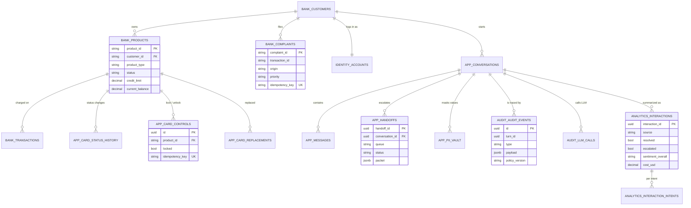

**Write model (ADR-011).** Provided tables are updated in place **and** a history row is written (`card_status_history`); new entities (claims) are appended with `origin='app'`. Every write is idempotent by key. The golden DB is never written by the app.

Redis keys: `conf:<id>` (confirmation plans, TTL 5 min), idempotency keys, `rl:*` rate limits, turn-cap counters, pub/sub channels `conv:<id>` and `handoff:<queue>`.

### 4.2.6 How Cardy retrieves data safely

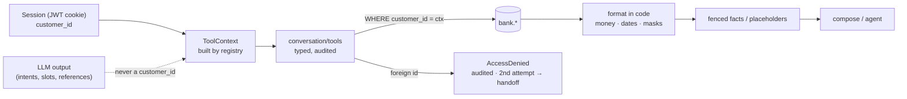

- **Session-bound identity (R1):** the customer comes only from the session. Routes cannot take a `customer_id` path parameter (a test asserts this).
- **Ownership checks:** a card or transaction of another customer returns `AccessDenied` (audited); the API answers `404` with the same body as "not found".
- **Data fences (R6):** tool output reaches the LLM inside fenced blocks as data, never as instructions; nodes that read tool output have no executing write tools.
- **Formatting in code (R4):** money (Babel, per locale), dates (day-first, bank TZ) and card masks (`•••• 1234`).

| Country | Money format |
|---|---|
| MX | `US$1,234.50 (≈ MXN $…)` — cards are in USD, MXN approximation from `daily_exchange_rates` |
| CO | `COP $1.234.567` |
| AR | `ARS $ 1.234,50` |

### 4.2.7 Data for the dashboard: the analytics worker (ADR-033)

```mermaid
flowchart LR
    subgraph OLTP
        C[(app.conversations<br/>app.messages · app.handoffs)]
        AE[(audit.audit_events<br/>reply_sent.segments)]
        LC[(audit.llm_calls)]
    end
    W["analytics-worker<br/>every 2 min · 512 MiB · pool 3<br/>role analytics_worker"]
    WS[(analytics.worker_state<br/>watermark)]
    C & AE & LC --> W
    WS <--> W
    W -->|Haiku 4.5 sentiment<br/>masked customer text| LC
    W --> I[(analytics.interactions)]
    W --> II[(analytics.interaction_intents)]
    MOCK["mock backfill<br/>source='mock', 30 days"] --> I & II
    I & II --> API["GET /staff/analytics/summary<br/>5 s timeout, admin only"] --> DASH["/staff/analytics"]
```

- **Candidate selection** by watermark. An interaction ends when the customer closes it, or after 30 minutes idle with no open handoff.
- **Strict resolution:** built from per-intent `segments` in `reply_sent`; a write intent is resolved only on a verified read-back turn.
- **Escalation cause groups:** *by design*, *customer choice*, *bot failure*, *security*.
- **Least privilege:** the `analytics_worker` role reads `app`, `audit`, `bank`; writes only `analytics`; inserts into `audit.llm_calls` (its own sentiment calls).

---

## 4.3 Machine Learning

### 4.3.1 Why the dataset can't train an intent model

The bank data has no usable intent labels: `call_transcripts.customer_text` has only 42 distinct strings, `detected_intents` has a single value, and `complaints.description` has 5 templates mapped 1:1 to their category. There is no Portuguese at all. So the learned components use **team-generated, labeled-as-such data**.

### 4.3.2 Learned component #1: pretrained LLM NLU vs keyword baseline (ADR-005)

The primary NLU is a pretrained LLM with a validated JSON contract. Its value is measured against a **keyword/regex baseline** (`keyword_nlu` + regional `lexicon.yaml`, clause splitting at connectors, precedence rules and a negation window), which shares the same flows and tools so only the NLU differs. On a 20-item smoke set both Sonnet and Haiku reached intent F1 1.000 against 0.635 for the keyword router. ADR-031 pins NLU to Sonnet 5.5 because intent detection drives routing and slots.

### 4.3.3 Learned component #2: the trained intent classifier (ADR-032, `intent_clf@v4`)

Purpose: a fast, offline, CPU-only intent model that keeps Cardy useful when the LLM is unavailable (degraded mode, §4.1.10).

```mermaid
flowchart LR
    SEED["Seeds per intent × locale<br/>(team-written)"] --> GEN["Generation<br/>gpt-6-luna<br/>prompts intent_gen@v1–v3"]
    GEN --> AUD["Human audit<br/>accept / reject"]
    AUD -->|2,902 accepted| DS[("Dataset<br/>22 classes × 4 locales<br/>ES-MX · ES-CO · ES-AR · PT-BR")]
    AUD -->|838 rejected| RJ[rejected log]
    DS --> CV["5-fold CV<br/>grouped by seed family"]
    CV --> CAND["Candidates<br/>C1 · C2 · C3A …"]
    CAND --> SEL["Selection rule D17<br/>best macro-F1, simplest within CI"]
    SEL --> THR["Threshold τ by cost rule"]
    THR --> BUN["Bundle 2.2 MB<br/>sha256 in model.lock"]
    BUN --> SRV["Serving in backend<br/>p95 3 ms"]
    BUN --> CARD[MODEL_CARD.md + runs/]
```

| Aspect | Detail |
|---|---|
| Data | 22 classes × 4 locales; 2,902 accepted, 838 rejected items; human-audited |
| Split | 5-fold CV **grouped by family** (paraphrases of one seed never straddle folds) |
| Selected model | **C2**: TF-IDF `char_wb` 2–5-grams + logistic regression (C = 100) |
| CV result | Macro-F1 **0.941**, 95% CI [0.924, 0.958] |
| Runner-up | C3A: multilingual-e5-small embeddings + LR, inside the CI but heavier |
| Why C2 | Rule D17: among candidates whose CI overlaps the best, pick the simplest/fastest; char n-grams handle regional spellings, typos and portuñol |
| Threshold | τ = 0.35, chosen by an explicit cost rule: wrong side-effect intent = 5, wrong read-only intent = 2, clarification = 1 |
| Artifact | 2.2 MB bundle, committed, pinned by SHA-256 in `ml/intent/model.lock`; the loader refuses a mismatched bundle and the app still starts (no classifier → degraded turns hand off) |
| Latency | p95 ≈ 3 ms on CPU |
| Tracking | Run records under `ml/intent/runs/<run_id>/`; `MODEL_CARD.md`; `make intent-gen`, `intent-train`, `intent-compare` |
| Traceability | Every degraded decision logs `source: classifier`, `classifier_version` and `label_set_version` |

**Selection by expected cost (threshold τ):**

```mermaid
flowchart LR
    X[utterance] --> P["p(max class)"]
    P -->|"≥ τ (0.35)"| ACT[route to intent]
    P -->|"< τ"| CLR[ask a clarifying question]
    ACT -.->|"wrong side-effect intent: cost 5<br/>wrong read-only intent: cost 2"| COST[(expected cost)]
    CLR -.->|"clarification: cost 1"| COST
```

**Known limitations** (from the model card): PT-BR is the weakest locale; the training text is generated, so real-traffic drift is expected; no held-out run has been reported yet.

### 4.3.4 Learned component #3: sentiment for analytics

The analytics worker labels each interaction's overall, start and end sentiment (negative / neutral / positive) with a Haiku 4.5 `sentiment` step over **masked** customer messages. Its cost is reported separately as "analytics overhead" and never added to per-interaction cost. (The handoff packet's `sentiment` field stays `null`; sentiment is analytics-only.)

---

## 4.4 Data Analytics

### 4.4.1 Exploratory analysis and data-quality findings

Notebook: `notebooks/01_card_customer_eda.ipynb` (sections 0–9). Findings that shaped the design:

| Finding | Consequence for the design |
|---|---|
| Row counts are 84–156% of the documented counts | Counts are measured, not assumed; contracts check shape, not size |
| Enum values are in Spanish (`Tarjeta Crédito`) | Staging normalizes enums; display labels are localized in code |
| Text fields are templated (5 complaint descriptions, 42 transcript texts) | No intent training from the dataset → team-generated data (§4.3) |
| `is_fraud` is deterministic above `fraud_score` 30 and noise below (AUC 0.50 without the score) | Compromise rule uses `fraud_score > 30`, not `is_fraud` |
| Only 24 merchants; 77% of transactions have none | Transaction search and pickers handle missing merchants gracefully |
| Mexican cards are denominated in USD | MX money shows USD with an MXN approximation (ADR-014) |
| No Portuguese in the data | PT-BR coverage comes from team-generated utterances; Brazilian rails are out of market |
| ≈ 20% of customers have no income | Never used in replies; eval covers null-data cases |
| Credit limits don't vary with income or score within a currency | Limits treated as given, no "why is my limit low" reasoning |

### 4.4.2 The Cardy control dashboard (`/staff/analytics`, admin only)

Filters: date range (default last 7 days, max 92), language (`es`/`pt`), country (`MX`/`CO`/`AR`), source (`all`/`real`/`mock`). A badge *"Incluye datos simulados"* and a footer note appear whenever mock rows are in view.

```mermaid
flowchart TB
    subgraph KPIs["KPI strip"]
        K1[Interactions] --- K2[Resolution rate] --- K3[Escalation rate] --- K4[Cost / interaction] --- K5[Messages / interaction] --- K6[Negative sentiment share]
    end
    subgraph Panels["3 × 2 panel grid"]
        P1["Outcomes per day<br/>(stacked: escalated · resolved ·<br/>abandoned · abstained · other)"]
        P2["Intents: volume +<br/>resolution rate"]
        P3["Escalations by cause group<br/>and queue · median time to claim"]
        P4["Sentiment: overall mix<br/>+ trajectory better/same/worse"]
        P5["Cost per day by step<br/>(nlu · compose · handoff_summary)<br/>per resolved · sentiment overhead"]
        P6["Recent 50 interactions<br/>→ link to timeline (real rows)"]
    end
    KPIs --> Panels
```

**Metric definitions** (every rate is returned with numerator and denominator, and is null when the denominator is 0):

| Metric | Definition |
|---|---|
| Interactions | Finished interactions in view (`ended_at <= now()`) |
| Resolution rate | `resolved = true` / `resolved IS NOT NULL` |
| Escalation rate | `escalated` / all rows |
| Messages per interaction | customer + bot + agent messages |
| Negative sentiment share | `negative` / rows with a sentiment |
| Sentiment trajectory | start vs end label on negative < neutral < positive |
| Cost per resolved interaction | `sum(cost_usd)` / resolved count |
| Median time to claim | `percentile_cont(0.5)` over `time_to_claim_s` |
| Daily outcome buckets | Exclusive, in order: escalated → resolved → abandoned → abstained → other (they sum to Interactions) |
| Intent volume | Excludes bot-offered segments the customer cancelled |

### 4.4.3 Staff traceability console ("why did the bot say this?")

`/staff/conversations` lists conversations with filters (language, country, intent, outcome, escalation, dates). `/staff/conversations/$id` shows a per-turn timeline:

```mermaid
flowchart LR
    T["Turn"] --> A["Customer text (masked)"]
    T --> B["NLU result<br/>(source llm / classifier / agent)"]
    T --> C["Rule hits<br/>(policy id + version)"]
    T --> D["Tool calls + results<br/>+ read-backs"]
    T --> E["LLM calls<br/>model · prompt version · tokens · cost · latency"]
    T --> F["Bot reply (masked) + sources"]
    T --> G["Langfuse link (local)"]
```

Only masked data is shown: no raw PII and no chain-of-thought.

---

## 5. Evaluation and testing

### 5.1 Systems compared on the same workload

| System | Description |
|---|---|
| **Baseline** | Keyword/regex NLU + the same flows, tools and policies + fixed ES/PT templates (`build_graph(system="baseline")`, `APP_ENV=eval` only). Isolates the value of the LLM layer |
| **Proposed** | Full system (LLM NLU, flows, agent, composer) |
| **Learned component** | LLM NLU vs keyword router; trained classifier vs keyword router vs LLM reference |
| Operational reference | Historical call-center figures from the dataset (FCR, handle time, escalation), labeled *not comparable 1:1* |

### 5.2 Harness

```mermaid
flowchart LR
    SC["Scenarios<br/>dev (~40 files) · heldout (frozen)"] --> RUN[harness runner]
    PER["personas.yaml (~30)"] --> RUN
    GOLD[(latam_golden)] -->|FILE_COPY clone| CL[("latam_eval_&lt;run_id&gt;")]
    RUN -->|restore + verify personas| CL
    RUN --> DRV["driver<br/>(test-idp session, API + SSE)"]
    SIM["LLM customer simulator<br/>gpt-6-luna, temp 0, ≤ 12 turns"] <--> DRV
    DRV --> SUT["System under test<br/>baseline | proposed"]
    SUT --> CL
    DRV --> CHK["Deterministic checks<br/>tools · DB state · policy ·<br/>packet · language · grounding · PII"]
    DRV --> JDG["LLM judge (reply quality)<br/>rubric.md · κ vs human labels"]
    CHK & JDG --> MET["metrics.py<br/>Wilson CIs"]
    MET --> REP["eval/reports/&lt;suite&gt;-&lt;sha10&gt;/<br/>report.md · metrics.json · meta.json"]
```

- **Scenario labels:** expected intents and outcome (`resolved`, `clarified`, `abstained`, `handoff:<queue>`), required and forbidden tools, expected DB state, required handoff fields, expected language, eligibility for automation.
- **Categories:** normal resolution, ambiguous, unsupported / out of market, human required, incorrect or missing data, expired session, unauthorized access, prompt injection (direct and via data fields), tool failures, multilingual ambiguity (portuñol, voseo, switches).
- **Freeze:** held-out cases are staged in `_staging/heldout`, human-reviewed, then frozen with `make eval-freeze`; CI runs `make eval-freeze-check`. The harness refuses `--suite heldout` without the lock (R9).
- **Reproducibility:** each run records git SHA, model IDs, prompt versions, policy hash and suite hash.

### 5.3 Metrics

| Metric | Definition |
|---|---|
| Safe automated resolution | Eligible case reaches the correct, policy-compliant outcome with no human |
| Containment | Case ends without transfer (never reported alone as success) |
| Escalation precision / recall | Right queue + complete packet; missed and unnecessary transfers |
| Unsafe outcomes | Unauthorized disclosure/action, materially wrong outcome, "done" without verification; 95% upper bound (rule of three when 0) |
| Clarification accuracy | Asked when required, not asked when not |
| NLU accuracy | Intent-set macro P/R/F1, exact-set match, status accuracy |
| Latency | p50 / p95 per turn and per conversation |
| Cost | Per attempted case and per successful automated resolution |

All rates carry *n* and a Wilson 95% CI, with breakdowns by language and customer segment. Every number is labeled *offline evaluation*, *simulation* or *projection*.

### 5.4 Results

> **TODO.** Results will be filled in once the final runs are complete. Evaluations that exist or are planned:
> - Trained intent classifier: cross-validation on the generated dataset (see `ml/intent/MODEL_CARD.md`).
> - NLU comparison (keyword baseline vs trained classifier vs LLM reference) on the dev NLU items.
> - End-to-end dev-suite runs (baseline vs proposed) under `eval/reports/`.
> - Held-out suite run (`make eval SUITE=heldout SYSTEM=both RUNS=3 NLU=suite`): pending.
> - LLM-judge agreement with human labels: pending.

### 5.5 Testing strategy and CI

Tests are deliberately minimal and targeted: every safety rule a change touches (R1–R6, R11, R13), each card's "Done when" lines, and one ES and one PT happy path per flow, always with a **fake LLM**.

```mermaid
flowchart LR
    PR[Pull request] --> BE["backend<br/>eval-freeze-check · ruff · ruff format<br/>mypy · import-linter · pytest unit"]
    PR --> PL["pipeline<br/>ruff · pytest"]
    PR --> FE["frontend<br/>biome ci · build"]
    PR --> E2E["e2e<br/>Playwright"]
    PR --> GL[gitleaks]
```

`make check` runs lint, types, import-linter and unit tests locally; `make test-integration` runs the database-backed tests.

---

## 6. Security, privacy and responsible AI

### 6.1 Engineering rules

| Rule | Requirement | How it is enforced |
|---|---|---|
| R1 | `customer_id` only from the session | `ToolContext` built by registry; route guard test forbids `customer_id` params |
| R2 | Side effects need a server-issued, single-use confirmation token | `ConfirmedWriteTools` + Redis plan store with atomic cursor |
| R3 | "Done" only after a verified read-back | `ActionResult.verified` required; flows check it |
| R4 | Money, dates, masks formatted in code | Localization domain (Babel); grounding check forbids stray digits |
| R5 | Only tokenized text reaches the LLM / Langfuse | PII vault masking; `LLMUnmaskedInput` refusal in the LLM client; Langfuse mask hook |
| R6 | Data fences; nodes reading tool output have no write tools | Fenced facts; agent has only `propose_plan` |
| R7 | Model, prompt, temperature pinned and traced | Model registry; `audit.llm_calls`; `/staff/system` |
| R8 | Policy in YAML with provenance | Policy registry fails startup otherwise; hash on every event |
| R9 | Held-out suite frozen | Lock file + CI freeze check; no transcript text in held-out reports |
| R10 | No secrets committed | gitleaks in pre-commit and CI; SSM in prod |
| R11 | 2 retries → degraded path → safe fallback + handoff | `core/llm` retry policy; degraded mode; `tool_failure` / `llm_unavailable` handoffs |
| R12 | History rows for changes; `origin='app'` on appends | Write model + migrations |
| R13 | Router-level role deps; foreign conversation → 404 | `require_role`, `get_owned_conversation`; route tests |

### 6.2 Identity and sessions

```mermaid
sequenceDiagram
    participant B as Browser
    participant API
    participant RL as Redis rate limit
    participant ID as identity.accounts
    B->>API: POST /auth/login {document_type, number, password}
    API->>API: login_key = HMAC-SHA256(key, "doc:TYPE:NUMBER")
    API->>RL: check 5 failures / 15 min
    API->>ID: lookup by login_key, verify PBKDF2
    API-->>B: Set-Cookie session (httpOnly, Secure in prod) + csrf_token
    Note over B,API: Every mutating call sends X-CSRF (double submit)
    B->>API: POST /auth/otp/verify {code} (step-up)
    API-->>B: refreshed session with step_up_at
```

- Mock IdP: every synthetic customer can log in with document type, number and password (ADR-008). No full document number is ever returned or logged (`login_hint` is masked).
- Staff: seeded accounts — one agent per queue (Atención, Cobranza, Fraudes, Reclamos) and one admin — with roles `agent` / `admin`.
- Revocation list for logged-out JWTs; session expiry mid-flow is resumable without losing the paused plan.

### 6.3 PII protection

```mermaid
flowchart LR
    IN["Customer text"] --> DET["Detectors<br/>Luhn card numbers · emails · phones<br/>document keywords · session customer's<br/>own document and names"]
    DET --> TOK["Replace with ⟨KIND_n⟩"]
    TOK --> VAULT[("app.pii_vault<br/>Fernet-encrypted,<br/>per conversation")]
    TOK --> LLM["LLM / Langfuse<br/>(tokenized only)"]
    LLM --> OUT["reply with tokens"] --> UN["unmask for display"] --> UI([Customer])
    TOK --> MSG[("app.messages<br/>encrypted content")]
```

Typed addresses become vault tokens (`⟨ADDR_n⟩`) and never reach the LLM, the graph state or the checkpoint.

### 6.4 Customer data stays inside AWS: Amazon Bedrock

**Using Amazon Bedrock in production is a key architecture decision (ADR-003 / ADR-028).** A bank cannot send customer conversations to a third-party service on the public internet. With Bedrock, the model runs inside AWS: the LLM call travels from our EC2 instance to the model and back without leaving the AWS network, and the model provider never sees the data.

```mermaid
flowchart LR
    subgraph AWS["AWS network (no public internet hop)"]
        subgraph EC2["Our EC2 instance · us-east-2"]
            BE["backend<br/>core/llm"]
            MASK["PII masking<br/>(§6.3)"]
            BE --> MASK
        end
        subgraph BR["Amazon Bedrock · us. inference profile<br/>(processed in a US Region)"]
            MDA["Model deployment account<br/>owned and run by AWS"]
        end
        MASK -->|"HTTPS (TLS 1.2+)<br/>signed with the instance role"| MDA
    end
    PROV(["Model provider<br/>(Anthropic)"]) -.-x|"no access to prompts<br/>or completions"| MDA
```

| Layer of protection | How |
|---|---|
| **Stays on the AWS network** | Traffic from an EC2 instance to an AWS service endpoint stays on AWS's private network ([AWS VPC FAQ](https://aws.amazon.com/vpc/faqs/)). Our `us.` cross-Region inference profiles may process a request in another US Region; that traffic also stays on the AWS network, does not cross the public internet, and is encrypted in transit ([Bedrock cross-Region inference](https://docs.aws.amazon.com/bedrock/latest/userguide/cross-region-inference.html)) |
| **The model provider never sees it** | Bedrock runs each model in a deployment account owned and operated by AWS. Model providers have no access to those accounts, so they cannot see prompts or completions ([Bedrock data protection](https://docs.aws.amazon.com/bedrock/latest/userguide/data-protection.html)). Content is not shared with model providers ([Bedrock data retention](https://docs.aws.amazon.com/bedrock/latest/userguide/data-retention.html)) |
| **No keys to leak** | The backend calls Bedrock with the EC2 instance role. No LLM API key exists in prod, and the role may invoke only the pinned model ARNs (`BedrockModelArns` in `infra/aws/ec2-stack.yaml`) |
| **Minimum data in the first place** | Only PII-masked text reaches the model (R5, §6.3): card numbers, documents, emails, phones, names and addresses are replaced with tokens before the call |
| **Every call on the record** | Each attempt is written to `audit.llm_calls` with masked input, model, tokens, latency and cost (R7) |

**Scope and limits, stated plainly**
- This applies to **production**. During the build we called the Anthropic API directly, only with synthetic data, and still with PII masking on (ADR-028).
- Processing stays within the **US** geography, not only in us-east-2, because the models are reached through `us.` inference profiles.
- The instance reaches Bedrock through its public regional endpoint (traffic still on the AWS network). A VPC interface endpoint (AWS PrivateLink) to keep the call inside our own VPC is on the path to production (§9).
- AWS may retain inputs and outputs for abuse detection, within AWS. They are not passed to the model provider.

### 6.5 Prompt injection and abuse

- The NLU flags `injection_suspected`; such turns go to `unsupported` and write no intent segment.
- Tool output (including data fields such as merchant names or complaint text) is fenced as data; the eval suite seeds injected text into data fields to test this.
- Even a fully compromised model cannot act: it has no write tool, cannot choose the customer, and plans run only from a code-rendered button.
- Asking for another customer's card or document → `AccessDenied`; the second attempt hands off as `unauthorized_access`.

### 6.6 Responsible AI

- Cardy states it is an AI assistant when asked, never gives financial advice or sells products, and never decides disputes or fraud.
- High-risk situations (fraud, regulator mentions, identity doubts, inactive customers) always go to a human.
- All synthetic content (data, policy, eval items, mock analytics) is labeled as such.

---

## 7. Design rationale and trade-offs

### 7.1 Key architecture decisions

| ADR | Decision | Why |
|---|---|---|
| 001 | FastAPI modular monolith + React | One deployable, enforced boundaries, typed end to end |
| 002 | Deterministic flows + read-only answer node | Predictable actions; LLM limited to language |
| 003 / 028 | Bedrock, model per step; Anthropic API during the build | Customer data stays inside AWS and never reaches the model provider (§6.4); IAM-role access; speed during the build |
| 004 / 005 | LLM intent classification vs keyword baseline | Robust multilingual NLU, with a measured baseline |
| 006 | Langfuse + OTel/Victoria + own audit tables | LLM tracing plus system telemetry plus a public ledger |
| 007 | LangGraph state + Postgres checkpointer, SSE transport | Durable pauses, streaming replies |
| 008 | Mock IdP with password + OTP step-up | Every synthetic customer can log in; step-up for risky actions |
| 009 / 010 | dbt-duckdb pipeline; whole-week date shift | Fast local transforms; realistic "now" |
| 011 | Update + history, append new entities, golden clones | Auditable writes, instant reset |
| 012 | Policy as versioned YAML | Rules reviewable outside prompts |
| 013 | Reversible per-conversation PII vault | LLM never sees raw PII, display still correct |
| 014 | MX cards in USD with MXN approximation | Faithful to the data |
| 015 | Handoff with live takeover | Real continuity, not a ticket dump |
| 016 | Evaluation design (baseline vs proposed, frozen held-out) | Honest, reproducible comparison |
| 017 | AWS single EC2 + Compose | Same artifact as dev, fits the plan and budget |
| 021 | Customer status takes precedence over card status | Inactive customers can only lock/block |
| 023 | Cost guard | Public URL with bounded spend |
| 025 | Router-level auth dependencies | Role checks can't be forgotten per route |
| 026 | Structured abstain replies | Out-of-scope answers offer the closest action or a human |
| 027 | One confirmation for multi-step plans | Fewer clicks, same safety |
| 029 | Brand: Cardy, from Swip | One voice across UI, prompts and handoff |
| 030 | Different model family for eval data | Avoid self-grading bias |
| 031 | Sonnet 5.5 for NLU | Intent detection drives routing and slots, so it gets the stronger model |
| 032 | Trained classifier + LLM-free degraded mode | Keep working when the LLM doesn't |
| 033 | Interaction analytics fact tables + worker | Dashboard off the OLTP path, least privilege |
| 034 | Debit cards show available balance | Supersedes ADR-020 (card facts only) |
| 035 | Tool-calling agent behind a flag | Natural conversation without write power |
| 036 | Judges' quick access behind a flag | One-click evaluation, off by default |

### 7.2 Trade-offs

| Dimension | Choice | Cost of the choice |
|---|---|---|
| Autonomy vs safety | The LLM proposes; code confirms, executes and verifies | Some requests need an extra click or question |
| Accuracy vs latency | Sonnet for NLU, Haiku for wording, 3 ms classifier for fallback | NLU turn latency dominated by one Sonnet call |
| Cost vs coverage | Turn caps, kill switch, degraded mode | Very long conversations are cut and handed off |
| Flexibility vs predictability | Flows for actions, agent only for conversation and reads | New action types need code, not just a prompt |
| Oversight | Every turn traceable; humans own fraud, disputes, regulator cases | Higher human load on high-risk cases by design |
| Simplicity vs availability | One EC2 box | No high availability (documented path to production) |

### 7.3 How it was built

#### Spec-driven development (SDD) pipeline

The project was built with a **spec-driven development (SDD) pipeline**. The rule is that no code is written before an approved specification. Work is split into cards over a day-by-day execution plan (D1–D9, [`07-execution-plan.md`](docs/solution-docs/07-execution-plan.md)). A card is either a task row such as `D1-A5` or a whole day track such as `D2-B`. Each card runs through the `/wave-run <card>` orchestrator, which gives one phase to each specialized coding-assistant agent:

```mermaid
flowchart LR
    CARD["Card (task row or day track)<br/>07-execution-plan.md"] --> SPEC["1 · spec-writer<br/>assumptions + questions"]
    SPEC --> HG1{{"Human gate<br/>answer questions,<br/>approve spec"}}
    HG1 --> SP["docs/specs/&lt;slug&gt;.md"]
    SP --> PLAN["2 · card-planner<br/>docs/plans/&lt;slug&gt;.md<br/>touch map · tests · task waves"]
    PLAN --> IMPL["3 · card-implementer<br/>one fresh agent per task<br/>runs only its own Verify"]
    IMPL --> VER["4 · card-verifier slices (parallel)<br/>V1 suite + diff · V2 safety rules R1–R13<br/>V3 Done-when proofs · V4 runtime harness"]
    VER --> HG2{{"Human gate<br/>review report,<br/>test the feature"}}
    HG2 --> MERGE["PR → develop → main"]
    IMPL -. "question or pivot" .-> HG1
```

| Phase | Agent | Output | What keeps it honest |
|---|---|---|---|
| Spec | `spec-writer` | `docs/specs/<slug>.md` | Runs in two passes: it first returns its assumptions and open questions, and writes the spec only after a human has answered them |
| Plan | `card-planner` | `docs/plans/<slug>.md` | Bound by the approved spec: a touch map, a minimal test list, and ordered tasks grouped into parallel waves |
| Implement | `card-implementer` | Code and tests | One fresh agent per task, limited to the files the plan lists for it; at most two repair rounds, then the question goes back to the human |
| Verify | `card-verifier` | `PASS / FAIL / UNVERIFIABLE` table with evidence | A separate, read-only agent that never grades its own work. It runs every check itself instead of trusting an implementer's claims |

Requirements for later features live in `docs/requirements/`. Every decision taken along the way is in the decision log, and every mid-card human decision is recorded in the card's state file.

#### Verification harnesses for the coding assistant

A green unit-test suite doesn't prove that a feature works in a browser, or that it logged and traced what it should. So the coding assistant gets **runtime harnesses**: MCP servers ([`.mcp.json`](.mcp.json)) that let an agent drive and inspect the real running stack (`make up`). Playwright, VictoriaLogs and VictoriaTraces run as dev-only Compose services (`docker/docker-compose.devtools.yml`). DeepWiki is a remote documentation service.

```mermaid
flowchart LR
    subgraph Agent["Coding assistant (implementer / verifier)"]
        A[agent]
    end
    subgraph Stack["Running dev stack (make up)"]
        NG["nginx → SPA + API"]
        BE["backend<br/>service.name = card-support-backend"]
        OT[OTel collector]
        VL[(VictoriaLogs)]
        VT[(VictoriaTraces)]
        NG --> BE --> OT --> VL & VT
    end
    A -->|"Playwright MCP<br/>navigate · snapshot · console · network"| NG
    A -->|"VictoriaLogs MCP<br/>LogsQL: errors, request_id"| VL
    A -->|"VictoriaTraces MCP<br/>spans by trace_id / operation"| VT
    A -->|"DeepWiki MCP<br/>library and repo docs"| DW[(DeepWiki)]
```

| Tool | Objective | How it was used during development |
|---|---|---|
| **Playwright** (MCP) | Prove that a feature works end to end in a real browser, through Nginx | The verifier opens every page or flow a card touched at `http://nginx/` and takes an accessibility snapshot. It asserts that the expected elements and text are on the page, checks the browser console for errors, and checks that the API calls the flow makes return 2xx. Implementers use it for their own UI checks: chat, confirmation cards, the OTP modal, the staff inbox, the timeline and the dashboard |
| **VictoriaLogs** (MCP) | Prove that the backend behaved as intended at runtime, with no hidden errors | LogsQL queries over the verification window, e.g. `_time:15m service.name:"card-support-backend" level:error`. Each call the harness just exercised is followed by its `request_id` |
| **VictoriaTraces** (MCP) | Prove that the expected work happened inside a request | Finds the spans of the exercised calls, by operation or by the `trace_id` taken from the logs. Confirms their status and the expected child spans (LLM steps, tool calls, DB writes) |
| **DeepWiki** (MCP) | Ground the agent in current library documentation instead of memory | Docs and repo lookups on dependencies such as LangGraph, FastAPI and TanStack while specs, plans and code were written. It is a knowledge helper, not a verification harness |

For the verifier, the three runtime harnesses are **mandatory** (slice V4). Each check becomes its own row in the report, with evidence attached: a snapshot excerpt, a query and its hit count, or a trace id. If a harness is unavailable, its rows are marked `UNVERIFIABLE`. They are never passed quietly, and never replaced by reading the code.

#### Human verification and evaluation

Agents did the typing. **Humans owned every decision and checked every result.**

```mermaid
flowchart TB
    H1["Design docs, ADRs<br/>and execution plan<br/>written and approved by humans"] --> H2["Spec gate<br/>humans answer every open question<br/>and approve each spec"]
    H2 --> H3["Mid-card escalations<br/>pivots and ambiguities go back<br/>to a human, recorded in the state file"]
    H3 --> H4["Verify gate<br/>humans review the verifier's evidence<br/>FAIL / UNVERIFIABLE rows go to them as they are"]
    H4 --> H5["Hands-on testing<br/>humans run the feature in the app<br/>ES and PT, customer and staff"]
    H5 --> H6["Pull request review<br/>develop → main"]
    H6 --> H7["Evaluation<br/>human audit of generated training data<br/>human review of held-out cases before freezing<br/>human labels to validate the LLM judge"]
```

- **Decisions:** when the design docs don't settle a choice, the agents stop and ask; they don't pick the plausible option. Every answer is recorded in the spec or the decision log.
- **Gates:** no spec is implemented without human approval, and no card is merged without a human reviewing the verifier's report and trying the feature.
- **Data and evaluation:** humans audited the generated intent data (838 of 3,740 items rejected), review 100% of held-out scenarios before they are frozen, and label cases to measure LLM-judge agreement.

---

## 8. Running and trying it

### 8.1 Local

Prerequisites, `.env` setup and troubleshooting are in [`README.md`](README.md).

| Command | What it does |
|---|---|
| `make setup` | Install toolchains (uv, npm), pre-commit hooks |
| `make data` | S3 (or local) → pipeline → Postgres → golden DB |
| `make up` / `make down` | Dev stack with hot reload + observability |
| `make demo-reset` | Restore `latam_app` from `latam_golden` |
| `make check` | Lint + types + import-linter + unit tests |
| `make test-integration` | DB-backed tests |
| `make client` | Regenerate the TypeScript API client from OpenAPI |
| `make analytics` | One analytics-worker pass over finished conversations |
| `make chat-sandbox` / `chat-api` / `chat-ui` | Talk to Cardy: CLI against a fake bank, CLI against the running API, or a Streamlit sandbox |
| `make eval SUITE=dev SYSTEM=proposed` | Run the evaluation harness |
| `make eval-freeze` / `eval-freeze-check` | Freeze / verify the held-out suite |
| `make intent-gen` / `intent-train` / `intent-compare` | Classifier data, training and comparison |
| `make graph-diagram` | Export the turn graph as Mermaid |
| `make langfuse-up` | Local Langfuse |
| `make infra-up` / `deploy` / `deploy-remote` / `smoke-prod` | AWS provisioning and deployment |

### 8.2 Judges' quick access

When `DEMO_QUICK_LOGIN=true` (judging window only), the landing page lists 10 curated demo personas (`eval/demo_personas.yaml`) with their country, cards, what to try, and suggested prompts in ES and PT. One click opens a customer session; another opens the admin staff console. The demo OTP is shown on the landing page.

### 8.3 Repository map

```
backend/            FastAPI app (api/v1, core, domains/*), Alembic, tests
  app/core/llm/       the only LLM gateway
  app/domains/conversation/flows/   deterministic flows
frontend/           React 19 SPA, Playwright e2e
pipeline/           ingest, contracts, dbt project, load, lineage
policies/           versioned synthetic policy YAML
ml/intent/          classifier data, training, bundle, model card, runs
eval/               harness, driver, simulator, judges, scenarios, personas, reports
notebooks/          EDA
docker/             Compose layers, nginx, otel, grafana
infra/aws/          CloudFormation stack and deploy scripts
docs/               solution design, decision log, specs, plans, requirements, brand
```

---

## 9. Limitations and path to production

**Current limitations**
- Single EC2 instance in one AZ: no high availability; demo-reset causes brief downtime.
- Mock IdP and fixed demo OTP; no real identity provider or OTP delivery.
- Policies are synthetic and not reviewed by a regulator; dispute handling is not legally validated.
- The trained classifier is trained on generated text; PT-BR is its weakest locale.
- The production deployment uses Sonnet 4.6 for NLU and agent (the AWS project cannot call Claude 5 models).
- Langfuse is local only; the public record is `audit.llm_calls`.
- Held-out evaluation and LLM-judge agreement are pending (§5.4).
- Staff one-click actions and the eval scorecard are not built.

**Path to production**

```mermaid
flowchart LR
    NOW["Today<br/>1 × EC2 + Compose"] --> P1["Compute<br/>ECS Fargate, 2+ AZs, ALB,<br/>ACM, AWS WAF, ECR signed images"]
    NOW --> P2["Data<br/>RDS PostgreSQL Multi-AZ + PITR,<br/>ElastiCache Redis"]
    NOW --> P3["Network & secrets<br/>private subnets, VPC endpoints<br/>(Bedrock, S3), Secrets Manager rotation"]
    NOW --> P4["Operations<br/>CloudWatch alarms, on-call,<br/>log retention, Langfuse host"]
    NOW --> P5["Scale & risk<br/>load tests, Bedrock quota plan,<br/>security review, pentest"]
    NOW --> P6["Business<br/>real IdP + OTP, regulatory review<br/>of disputes, workforce integration"]
```

---

## 10. Appendix

### 10.1 Glossary

| Term | Meaning |
|---|---|
| Turn | One customer message and the bot's processing of it |
| Flow | Deterministic code path for one intent |
| Plan | An ordered list of side-effecting steps behind one confirmation token |
| Read-back | Re-reading the record after a write to verify it |
| Step-up | Extra verification (OTP) before a sensitive action |
| Handoff | Transfer to a human queue with a structured packet |
| Live takeover | A staff agent chatting in the customer's window |
| Degraded mode | LLM-free turn using the trained classifier and templates |
| Golden DB | Pristine database template used for resets and eval clones |
| Grounding | Every value in a reply comes from code-provided facts |
| Fence | Marking tool output as data, not instructions |
| Segment | One intent's outcome within a turn, recorded for analytics |

### 10.2 Design document index

| Document | Content |
|---|---|
| [`docs/solution-docs/01-technical-design.md`](docs/solution-docs/01-technical-design.md) | Architecture and components |
| [`docs/solution-docs/02-conversation-design.md`](docs/solution-docs/02-conversation-design.md) | Turn graph, flows, agent, replies |
| [`docs/solution-docs/03-data-architecture.md`](docs/solution-docs/03-data-architecture.md) | Pipeline, schemas, date shift, identity |
| [`docs/solution-docs/04-contracts.md`](docs/solution-docs/04-contracts.md) | Tools, NLU, API, SSE, packet, policy, audit, tokens |
| [`docs/solution-docs/05-evaluation-plan.md`](docs/solution-docs/05-evaluation-plan.md) | Suites, systems, judging, metrics |
| [`docs/solution-docs/06-engineering-rules.md`](docs/solution-docs/06-engineering-rules.md) | R1–R13 and engineering conventions |
| [`docs/solution-docs/07-execution-plan.md`](docs/solution-docs/07-execution-plan.md) | Day-by-day cards |
| [`docs/solution-docs/08-deployment.md`](docs/solution-docs/08-deployment.md) | AWS deployment |
| [`docs/solution-docs/decision-log.md`](docs/solution-docs/decision-log.md) | ADR-001 … ADR-036 |
| [`docs/brand.md`](docs/brand.md) | Voice, tone and visual identity |
| [`ml/intent/MODEL_CARD.md`](ml/intent/MODEL_CARD.md) | Trained classifier model card |

### 10.3 Judging criteria → sections

| Criterion | Where |
|---|---|
| It works | §2, §8 (quick access, deployment) |
| AI Engineering — backend | §3, §4.1.1–4.1.11 |
| AI Engineering — frontend | §4.1.12 |
| AI Engineering — deployment | §4.1.13, §4.1.14, §9 |
| Rationale and documentation | §7, §10.2 |
| Data Engineering — extraction and transformation | §4.2 |
| Machine Learning — selection, optimization, implementation, tracking | §4.3 |
| Data Analytics — data quality and insights | §4.4 |
| Evaluation | §5 |
| Security and responsible AI | §6 |
