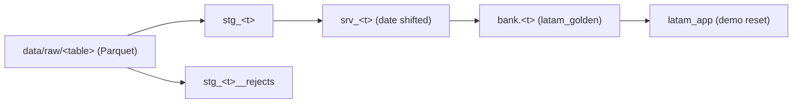

# Data lineage

- **Contracts:** `python -m contracts` validates raw partitions with Pandera; column aliases live in `pipeline/contracts/aliases.yaml`, shared with dbt's `column_aliases` var.
- **Reports:** `data/quality/<run_id>/` holds `contract_report.json`, `quality_report.json` and `quality_report.md` (row counts, rejects, dbt tests, orphans).
- **Lineage docs:** `dbt docs generate` writes `data/lineage/<run_id>/index.html`.
